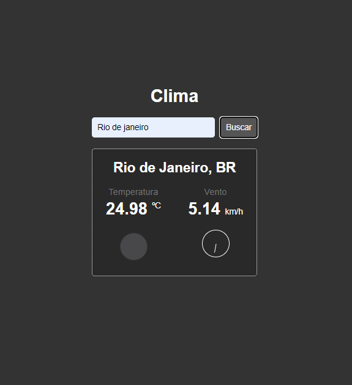

# Clima JS

Este projeto é um desafio do curso de Javascript da b7web, com ele pude praticar as minha habilidades de manipulação de DOM com o javascript. O principal desafio desse projeto foi realizar a requisição a API do OpenWeather.

## Layout 

## Licença

 Este projeto esta sob licença MIT 

# Clima JS

## Introdução

O projeto Clima JS foi desenvolvido como parte de um desafio do curso de Javascript da b7web. Ele tem como objetivo praticar as habilidades de manipulação do DOM usando JavaScript. A principal tarefa desse projeto foi realizar uma requisição à API do OpenWeather para obter informações sobre o clima.

## Funcionalidades

- Exibir o clima atual de uma cidade específica;
- Mostrar a temperatura em graus Celsius;
- Exibir uma descrição do clima (exemplo: ensolarado, chuvoso, nublado, etc.);
- Exibir a umidade do ar;
- Exibir a velocidade do vento.

## Tecnologias Utilizadas

- HTML5
- CSS3
- JavaScript
- API do OpenWeather

## Instalação

1. Clone ou baixe este repositório para o seu computador.
2. Abra o arquivo `index.html` no seu navegador.

## Uso

1. Abra o aplicativo no navegador.
2. Insira o nome de uma cidade na caixa de busca.
3. Pressione o botão "Buscar" ou pressione a tecla "Enter".
4. O aplicativo exibirá as informações climáticas da cidade inserida.

## Contribuição

Contribuições são bem-vindas! Sinta-se à vontade para fazer um fork deste projeto e abrir um pull request com melhorias, correções de bugs ou novas funcionalidades.

## Licença

Este projeto está sob a licença MIT. Consulte o arquivo [LICENSE](LICENSE) para obter mais informações.

## Contato

Se você tiver alguma dúvida ou sugestão, entre em contato comigo pelo e-mail: wallace.vilela9@outlook.com.

---

## Notas de Versão

### v1.0.0

- Primeiro lançamento estável do projeto
- Funcionalidades de exibição do clima e informações adicionadas

## Agradecimentos

Agradeço à equipe da b7web pelo excelente curso que me permitiu desenvolver este projeto e a todos que contribuíram para o desenvolvimento e aperfeiçoamento do mesmo.